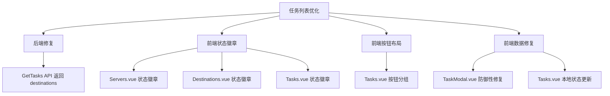
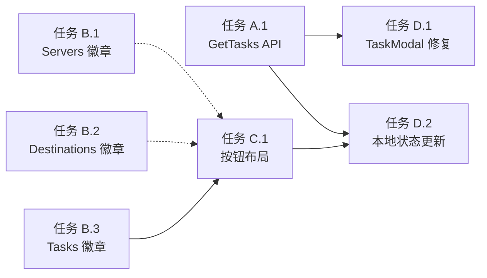

# 功能规划：任务列表优化与数据丢失修复

**规划时间**：2026-01-08
**预估工作量**：18 任务点

---

## 1. 功能概述

### 1.1 目标

解决备份任务列表的四个问题：
1. 所有列表（服务器、备份目标、备份任务）添加状态徽章显示
2. 备份任务列表按钮重新布局（分组显示）
3. 修复任务启用/禁用后列表数据丢失的问题
4. 修复编辑任务时 destinations 数据为空的问题

### 1.2 范围

**包含**：
- 前端：Servers.vue、Destinations.vue、Tasks.vue 添加状态徽章
- 前端：Tasks.vue 按钮布局优化
- 前端：TaskModal.vue 防御性修复
- 后端：GetTasks API 返回 destinations 关联数据
- 前端：Tasks.vue 本地状态更新优化

**不包含**：
- 其他列表页面的修改
- 数据库迁移
- 新增功能

### 1.3 技术约束

- 前端：Vue 3 Composition API，Tailwind CSS
- 后端：Go + Gin + GORM
- 状态徽章样式：保持与现有设计一致（绿色启用、灰色禁用）
- 按钮布局：使用 Flexbox 分组

---

## 2. WBS 任务分解

### 2.1 分解结构图



### 2.2 任务清单

#### 模块 A：后端 API 修复（3 任务点）

**文件**: `cmd/server/handler.go` 或 `internal/handler/task.go`

- [ ] **任务 A.1**：修复 GetTasks API 返回 destinations 关联数据（3 点）
  - **输入**：当前 GetTasks 实现
  - **输出**：返回完整的 task 对象，包含 destinations 数组
  - **关键步骤**：
    1. 定位 GetTasks 处理器函数
    2. 在 GORM 查询中添加 `.Preload("Destinations")` 关联加载
    3. 验证返回的 JSON 结构包含 destinations 字段
    4. 测试 API 返回数据完整性

---

#### 模块 B：前端状态徽章（6 任务点）

**文件**: `web/frontend/src/views/Servers.vue`、`Destinations.vue`、`Tasks.vue`

- [ ] **任务 B.1**：Servers.vue 添加启用/禁用状态徽章（2 点）
  - **输入**：现有 Servers.vue 代码
  - **输出**：在服务器名称右侧显示状态徽章
  - **关键步骤**：
    1. 在第 40-52 行（类型徽章后）添加状态徽章
    2. 启用：绿色徽章 `bg-brutalist-green text-white`
    3. 禁用：灰色徽章 `bg-gray-300 text-gray-700`
    4. 徽章文本：启用/禁用

- [ ] **任务 B.2**：Destinations.vue 添加启用/禁用状态徽章（2 点）
  - **输入**：现有 Destinations.vue 代码
  - **输出**：在备份目标名称右侧显示状态徽章
  - **关键步骤**：
    1. 在第 42-57 行（类型徽章和加密状态徽章后）添加状态徽章
    2. 启用：绿色徽章 `bg-brutalist-green text-white`
    3. 禁用：灰色徽章 `bg-gray-300 text-gray-700`
    4. 徽章文本：启用/禁用

- [ ] **任务 B.3**：Tasks.vue 添加启用/禁用状态徽章（2 点）
  - **输入**：现有 Tasks.vue 代码
  - **输出**：在任务名称右侧显示状态徽章
  - **关键步骤**：
    1. 在第 31 行（任务名称后）添加状态徽章
    2. 启用：绿色徽章 `bg-brutalist-green text-white`
    3. 禁用：灰色徽章 `bg-gray-300 text-gray-700`
    4. 徽章文本：启用/禁用

---

#### 模块 C：前端按钮布局优化（4 任务点）

**文件**: `web/frontend/src/views/Tasks.vue`

- [ ] **任务 C.1**：重构 Tasks.vue 按钮布局（4 点）
  - **输入**：现有按钮布局（第 41-71 行）
  - **输出**：分组按钮布局
  - **关键步骤**：
    1. 将按钮分为两组：
       - 分组 1：状态按钮（已启用/已禁用）
       - 分组 2：操作按钮（立即执行、编辑、删除）
    2. 在两组之间添加分隔符 `<div class="w-px h-6 bg-gray-300"></div>`
    3. 调整按钮样式保持一致性
    4. 验证响应式布局

---

#### 模块 D：前端数据修复（5 任务点）

**文件**: `web/frontend/src/components/TaskModal.vue`、`web/frontend/src/views/Tasks.vue`

- [ ] **任务 D.1**：TaskModal.vue 防御性修复（2 点）
  - **输入**：现有 TaskModal.vue 代码（第 98-113 行）
  - **输出**：安全的 destinations 数据处理
  - **关键步骤**：
    1. 在 watch 中添加容错逻辑
    2. 使用可选链操作符 `?.` 安全访问 destinations
    3. 添加默认值处理：`newTask.destinations?.map(d => d.id) || []`
    4. 添加日志输出便于调试

- [ ] **任务 D.2**：Tasks.vue 本地状态更新优化（3 点）
  - **输入**：现有 toggleTask 函数（第 110-119 行）
  - **输出**：优化的状态更新逻辑
  - **关键步骤**：
    1. 在 toggleTask 函数中添加本地状态更新
    2. 立即更新 tasks 数组中对应任务的 enabled 状态
    3. 保留 loadTasks() 调用作为数据同步
    4. 添加错误回滚逻辑

---

## 3. 依赖关系

### 3.1 依赖图



### 3.2 依赖说明

| 任务 | 依赖于 | 原因 | 优先级 |
|------|--------|------|--------|
| D.1 (TaskModal 修复) | A.1 (GetTasks API) | 需要后端返回完整 destinations 数据 | 高 |
| D.2 (本地状态更新) | A.1 (GetTasks API) | 需要后端数据完整性保证 | 高 |
| C.1 (按钮布局) | B.3 (Tasks 徽章) | 徽章添加后调整按钮布局 | 中 |
| B.1, B.2 (其他徽章) | 无 | 可独立完成 | 低 |

### 3.3 并行任务

以下任务可以并行开发：
- 任务 B.1 (Servers 徽章) ∥ 任务 B.2 (Destinations 徽章)
- 任务 B.1 ∥ 任务 B.2 ∥ 任务 A.1 (后端 API)
- 任务 D.1 ∥ 任务 D.2 (可在 A.1 完成后同时进行)

---

## 4. 实施建议

### 4.1 技术选型

| 需求 | 推荐方案 | 理由 |
|------|----------|------|
| 状态徽章样式 | Tailwind CSS 工具类 | 与现有设计一致，无需新增 CSS |
| 按钮分组 | Flexbox + gap | 简洁、响应式、易维护 |
| 数据关联加载 | GORM Preload | 标准 ORM 做法，性能好 |
| 防御性编程 | 可选链 + 默认值 | 提高代码健壮性 |

### 4.2 潜在风险

| 风险 | 影响 | 缓解措施 |
|------|------|----------|
| 后端 API 返回数据结构变化 | 中 | 前端添加容错逻辑，使用可选链 |
| 按钮布局在小屏幕上换行 | 低 | 添加响应式类 `flex-wrap` 或 `flex-col` |
| 状态更新不同步 | 中 | 保留 loadTasks() 调用，添加本地更新 |
| 性能问题（Preload 导致查询变慢） | 低 | 监控 API 响应时间，必要时添加缓存 |

### 4.3 测试策略

- **单元测试**：
  - TaskModal.vue 的 watch 逻辑
  - Tasks.vue 的 toggleTask 函数

- **集成测试**：
  - GetTasks API 返回完整数据
  - 任务启用/禁用后列表数据完整性
  - 编辑任务时 destinations 正确回显

- **E2E 测试**：
  - 完整的任务启用/禁用/编辑流程
  - 状态徽章正确显示
  - 按钮布局在不同屏幕尺寸下的表现

---

## 5. 详细实施步骤

### 步骤 1：后端 API 修复（优先级最高）

**文件**：`cmd/server/handler.go` 或 `internal/handler/task.go`

**操作**：
1. 找到 GetTasks 或 GetAllTasks 处理器函数
2. 定位 GORM 查询语句
3. 添加 `.Preload("Destinations")` 关联加载

**示例代码**：
```go
// 修改前
tasks := []models.BackupTask{}
db.Find(&tasks)

// 修改后
tasks := []models.BackupTask{}
db.Preload("Destinations").Find(&tasks)
```

**验证**：
- 调用 `/api/tasks` 接口
- 检查返回的 JSON 中是否包含 `destinations` 字段
- 确保 destinations 数组不为空（如果任务有关联目标）

---

### 步骤 2：前端状态徽章（可并行）

#### 2.1 Servers.vue 状态徽章

**文件**：`web/frontend/src/views/Servers.vue`

**位置**：第 40-52 行（类型徽章后）

**修改**：
```vue
<!-- 原代码 -->
<div class="flex items-center gap-2 mb-3">
  <h3 class="text-base font-black text-gray-900 leading-6">{{ server.name }}</h3>
  <!-- 服务器类型标签 -->
  <span :class="[...]">
    {{ isOfficialServer(server) ? '官方' : '自建' }}
  </span>
</div>

<!-- 修改后 -->
<div class="flex items-center gap-2 mb-3">
  <h3 class="text-base font-black text-gray-900 leading-6">{{ server.name }}</h3>
  <!-- 服务器类型标签 -->
  <span :class="[...]">
    {{ isOfficialServer(server) ? '官方' : '自建' }}
  </span>
  <!-- 启用/禁用状态徽章 -->
  <span
    :class="[
      'px-2 py-0.5 text-xs font-bold rounded border-2 border-black',
      server.enabled
        ? 'bg-brutalist-green text-white'
        : 'bg-gray-300 text-gray-700'
    ]"
  >
    {{ server.enabled ? '启用' : '禁用' }}
  </span>
</div>
```

#### 2.2 Destinations.vue 状态徽章

**文件**：`web/frontend/src/views/Destinations.vue`

**位置**：第 42-57 行（加密状态徽章后）

**修改**：
```vue
<!-- 在加密状态徽章后添加 -->
<!-- 启用/禁用状态徽章 -->
<span
  :class="[
    'px-2 py-0.5 text-xs font-bold rounded border-2 border-black',
    destination.enabled
      ? 'bg-brutalist-green text-white'
      : 'bg-gray-300 text-gray-700'
  ]"
>
  {{ destination.enabled ? '启用' : '禁用' }}
</span>
```

#### 2.3 Tasks.vue 状态徽章

**文件**：`web/frontend/src/views/Tasks.vue`

**位置**：第 31 行（任务名称后）

**修改**：
```vue
<!-- 原代码 -->
<h3 class="text-base font-black text-gray-900 mb-3 leading-6">{{ task.name }}</h3>

<!-- 修改后 -->
<div class="flex items-center gap-2 mb-3">
  <h3 class="text-base font-black text-gray-900 leading-6">{{ task.name }}</h3>
  <!-- 启用/禁用状态徽章 -->
  <span
    :class="[
      'px-2 py-0.5 text-xs font-bold rounded border-2 border-black',
      task.enabled
        ? 'bg-brutalist-green text-white'
        : 'bg-gray-300 text-gray-700'
    ]"
  >
    {{ task.enabled ? '启用' : '禁用' }}
  </span>
</div>
```

---

### 步骤 3：前端按钮布局优化

**文件**：`web/frontend/src/views/Tasks.vue`

**位置**：第 40-71 行（操作按钮区域）

**修改**：
```vue
<!-- 原代码 -->
<div class="flex items-center gap-2 ml-4">
  <button
    @click="toggleTask(task.id, !task.enabled)"
    :class="[...]"
  >
    {{ task.enabled ? '已启用' : '已禁用' }}
  </button>
  <button @click="executeTask(task.id)" class="...">
    立即执行
  </button>
  <button @click="editTask(task)" class="...">
    编辑
  </button>
  <button @click="deleteTask(task.id)" class="...">
    删除
  </button>
</div>

<!-- 修改后 -->
<div class="flex items-center gap-2 ml-4">
  <!-- 分组 1：状态按钮 -->
  <button
    @click="toggleTask(task.id, !task.enabled)"
    :class="[
      'px-3 py-1 text-sm font-bold rounded border-2 border-black transition-all',
      task.enabled
        ? 'bg-green-100 text-green-800 hover:bg-green-200'
        : 'bg-gray-100 text-gray-800 hover:bg-gray-200'
    ]"
  >
    {{ task.enabled ? '已启用' : '已禁用' }}
  </button>

  <!-- 分隔符 -->
  <div class="w-px h-6 bg-gray-300"></div>

  <!-- 分组 2：操作按钮 -->
  <button
    @click="executeTask(task.id)"
    class="px-3 py-1 text-sm font-bold text-brutalist-green hover:bg-green-50 rounded border-2 border-black transition-all"
  >
    立即执行
  </button>
  <button
    @click="editTask(task)"
    class="px-3 py-1 text-sm font-bold text-brutalist-blue hover:bg-blue-50 rounded border-2 border-black transition-all"
  >
    编辑
  </button>
  <button
    @click="deleteTask(task.id)"
    class="px-3 py-1 text-sm font-bold text-brutalist-red hover:bg-red-50 rounded border-2 border-black transition-all"
  >
    删除
  </button>
</div>
```

---

### 步骤 4：前端数据修复

#### 4.1 TaskModal.vue 防御性修复

**文件**：`web/frontend/src/components/TaskModal.vue`

**位置**：第 98-113 行（watch 函数）

**修改**：
```javascript
// 原代码
watch(() => props.task, (newTask) => {
  if (newTask) {
    formData.value = {
      ...newTask,
      destination_ids: newTask.destinations?.map(d => d.id) || []
    }
  } else {
    formData.value = {
      name: '',
      cron_expression: '',
      source_server_id: '',
      destination_ids: [],
      enabled: true
    }
  }
}, { immediate: true })

// 修改后（添加日志和更多容错）
watch(() => props.task, (newTask) => {
  if (newTask) {
    console.log('TaskModal: Loading task', newTask)
    const destinationIds = newTask.destinations?.map(d => d.id) || []
    console.log('TaskModal: Extracted destination IDs', destinationIds)

    formData.value = {
      ...newTask,
      destination_ids: destinationIds
    }
  } else {
    formData.value = {
      name: '',
      cron_expression: '',
      source_server_id: '',
      destination_ids: [],
      enabled: true
    }
  }
}, { immediate: true })
```

#### 4.2 Tasks.vue 本地状态更新

**文件**：`web/frontend/src/views/Tasks.vue`

**位置**：第 110-119 行（toggleTask 函数）

**修改**：
```javascript
// 原代码
const toggleTask = async (id, enabled) => {
  try {
    await tasksApi.update(id, { enabled })
    toast.success(enabled ? '任务已启用' : '任务已禁用')
    loadTasks()
  } catch (error) {
    console.error('Failed to toggle task:', error)
    toast.error('操作失败')
  }
}

// 修改后（添加本地状态更新）
const toggleTask = async (id, enabled) => {
  // 保存原始状态用于回滚
  const taskIndex = tasks.value.findIndex(t => t.id === id)
  const originalEnabled = tasks.value[taskIndex]?.enabled

  try {
    // 立即更新本地状态（乐观更新）
    if (taskIndex !== -1) {
      tasks.value[taskIndex].enabled = enabled
    }

    // 调用 API 更新
    await tasksApi.update(id, { enabled })
    toast.success(enabled ? '任务已启用' : '任务已禁用')

    // 后台同步数据（确保数据一致性）
    loadTasks()
  } catch (error) {
    console.error('Failed to toggle task:', error)

    // 错误时回滚本地状态
    if (taskIndex !== -1 && originalEnabled !== undefined) {
      tasks.value[taskIndex].enabled = originalEnabled
    }

    toast.error('操作失败')
  }
}
```

---

## 6. 验证清单

### 编译测试
- [ ] 后端编译通过：`go build ./cmd/server`
- [ ] 前端编译通过：`npm run build`
- [ ] 无 TypeScript/ESLint 错误

### 功能测试
- [ ] GetTasks API 返回完整的 destinations 数据
- [ ] 任务启用/禁用后列表数据不丢失
- [ ] 编辑任务时 destinations 正确回显
- [ ] 状态徽章在三个列表中正确显示
- [ ] 按钮布局在不同屏幕尺寸下正常显示

### UI 测试
- [ ] 状态徽章颜色正确（启用绿色、禁用灰色）
- [ ] 按钮分隔符清晰可见
- [ ] 按钮布局不重叠、不换行（在正常屏幕尺寸下）
- [ ] 响应式布局在移动设备上正常

### 数据一致性测试
- [ ] 刷新页面后数据一致
- [ ] 多个标签页同时操作不冲突
- [ ] 网络延迟情况下状态正确

---

## 7. 后续优化方向

Phase 2 可考虑的增强：
- 添加批量操作功能（批量启用/禁用）
- 添加搜索和筛选功能
- 添加排序功能
- 优化移动端布局
- 添加撤销功能
