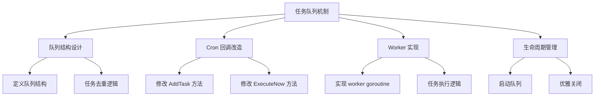
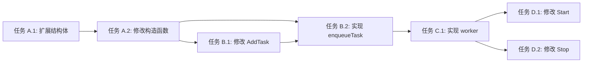

# 功能规划：任务队列机制

**规划时间**：2026-01-21
**预估工作量**：8 任务点

---

## 1. 功能概述

### 1.1 目标

解决备份任务阻塞 Cron 调度器的问题，实现非阻塞的任务调度机制。

**核心问题**：
- 当前备份任务在 Cron 回调函数中同步执行
- 长时间运行的备份任务会阻塞 Cron goroutine
- 影响其他定时任务的准时触发

**解决方案**：
- 引入任务队列（基于 channel）
- Cron 触发时立即投递任务到队列并返回
- 独立 worker goroutine 串行处理队列中的任务
- 保持对 bw CLI 的互斥保护（已有全局锁 `bwMu`）

### 1.2 范围

**包含**：
- 创建任务队列结构（buffered channel）
- 修改 Cron 回调为非阻塞投递
- 实现 worker goroutine 处理队列任务
- 优雅关闭机制（等待队列清空或超时）
- 任务去重逻辑（防止同一任务重复入队）

**不包含**：
- 任务优先级调度
- 多 worker 并发处理
- 任务持久化到数据库

### 1.3 技术约束

- 使用 Go channel 实现队列
- 保持现有备份逻辑不变
- 不修改数据库模型
- 兼容现有的日志和错误处理

---

## 2. WBS 任务分解

### 2.1 分解结构图



### 2.2 任务清单

#### 模块 A：队列结构设计（2 任务点）

**文件**: `internal/scheduler/scheduler.go`

- [ ] **任务 A.1**：扩展 Scheduler 结构体（1 点）
  - **输入**：现有 Scheduler 定义
  - **输出**：支持任务队列的 Scheduler
  - **关键步骤**：
    1. 添加 `taskQueue chan uint` 字段（任务 ID 队列）
    2. 添加 `queuedTasks map[uint]bool` 字段（去重映射）
    3. 添加 `queueMu sync.Mutex` 字段（保护去重映射）
    4. 添加 `stopChan chan struct{}` 字段（停止信号）
    5. 添加 `workerDone chan struct{}` 字段（worker 完成信号）

  **代码示例**：
  ```go
  type Scheduler struct {
      cron        *cron.Cron
      taskEntries map[uint]cron.EntryID
      mu          sync.RWMutex

      // 任务队列相关
      taskQueue   chan uint           // 任务 ID 队列
      queuedTasks map[uint]bool       // 已入队任务（去重）
      queueMu     sync.Mutex          // 保护 queuedTasks
      stopChan    chan struct{}       // 停止信号
      workerDone  chan struct{}       // worker 完成信号
  }
  ```

- [ ] **任务 A.2**：修改 New 构造函数（1 点）
  - **输入**：现有构造函数
  - **输出**：初始化队列字段的构造函数
  - **关键步骤**：
    1. 初始化 `taskQueue` 为 buffered channel（容量 100）
    2. 初始化 `queuedTasks` 为空 map
    3. 初始化 `stopChan` 和 `workerDone`

  **代码示例**：
  ```go
  func New() *Scheduler {
      return &Scheduler{
          cron:        cron.New(cron.WithSeconds()),
          taskEntries: make(map[uint]cron.EntryID),
          taskQueue:   make(chan uint, 100),
          queuedTasks: make(map[uint]bool),
          stopChan:    make(chan struct{}),
          workerDone:  make(chan struct{}),
      }
  }
  ```

---

#### 模块 B：Cron 回调改造（2 任务点）

**文件**: `internal/scheduler/execute.go`

- [ ] **任务 B.1**：修改 AddTask 方法为非阻塞投递（1 点）
  - **输入**：现有 AddTask 实现（第 24-51 行）
  - **输出**：非阻塞的任务投递逻辑
  - **关键步骤**：
    1. 将 Cron 回调函数改为调用 `s.enqueueTask(taskID)`
    2. 移除直接调用 `s.executeTask(latestTask)`

  **代码示例**：
  ```go
  func (s *Scheduler) AddTask(task model.BackupTask) error {
      cronExpr := normalizeCron(task.CronExpression)
      taskID := task.ID
      entryID, err := s.cron.AddFunc(cronExpr, func() {
          // 非阻塞投递到队列
          s.enqueueTask(taskID)
      })
      if err != nil {
          return fmt.Errorf("failed to add cron job: %w", err)
      }

      s.mu.Lock()
      s.taskEntries[task.ID] = entryID
      s.mu.Unlock()

      logger.Module(logger.ModuleScheduler).Info("Task added", "name", task.Name, "id", task.ID, "cron", task.CronExpression)
      return nil
  }
  ```

- [ ] **任务 B.2**：实现 enqueueTask 方法（1 点）
  - **输入**：任务 ID
  - **输出**：任务入队（带去重）
  - **关键步骤**：
    1. 检查任务是否已在队列中
    2. 如果未入队，标记并发送到 channel
    3. 如果已入队，记录日志并跳过

  **代码示例**：
  ```go
  // enqueueTask 将任务投递到队列（带去重）
  func (s *Scheduler) enqueueTask(taskID uint) {
      s.queueMu.Lock()
      if s.queuedTasks[taskID] {
          s.queueMu.Unlock()
          logger.Module(logger.ModuleScheduler).Info("Task already queued, skipping", "id", taskID)
          return
      }
      s.queuedTasks[taskID] = true
      s.queueMu.Unlock()

      select {
      case s.taskQueue <- taskID:
          logger.Module(logger.ModuleScheduler).Info("Task enqueued", "id", taskID)
      default:
          // 队列已满，移除去重标记
          s.queueMu.Lock()
          delete(s.queuedTasks, taskID)
          s.queueMu.Unlock()
          logger.Module(logger.ModuleScheduler).Error("Task queue full, dropping task", "id", taskID)
      }
  }
  ```

---

#### 模块 C：Worker 实现（2 任务点）

**文件**: `internal/scheduler/scheduler.go`

- [ ] **任务 C.1**：实现 worker goroutine（2 点）
  - **输入**：任务队列 channel
  - **输出**：串行处理任务的 worker
  - **关键步骤**：
    1. 创建 `startWorker()` 方法
    2. 循环从 `taskQueue` 读取任务 ID
    3. 查询数据库获取最新任务配置
    4. 检查任务是否启用
    5. 调用 `executeTask` 执行备份
    6. 执行完成后从 `queuedTasks` 移除标记
    7. 监听 `stopChan` 实现优雅退出

  **代码示例**：
  ```go
  // startWorker 启动任务队列处理 worker
  func (s *Scheduler) startWorker() {
      go func() {
          defer close(s.workerDone)
          logger.Module(logger.ModuleScheduler).Info("Task queue worker started")

          for {
              select {
              case taskID := <-s.taskQueue:
                  s.processTask(taskID)
              case <-s.stopChan:
                  logger.Module(logger.ModuleScheduler).Info("Worker received stop signal, draining queue")
                  // 处理剩余任务
                  for {
                      select {
                      case taskID := <-s.taskQueue:
                          s.processTask(taskID)
                      default:
                          logger.Module(logger.ModuleScheduler).Info("Worker stopped")
                          return
                      }
                  }
              }
          }
      }()
  }

  // processTask 处理单个任务
  func (s *Scheduler) processTask(taskID uint) {
      // 从数据库获取最新任务配置
      var task model.BackupTask
      if err := database.DB.Preload("Destinations").First(&task, taskID).Error; err != nil {
          logger.Module(logger.ModuleScheduler).Error("Failed to fetch task", "id", taskID, "error", err)
          s.removeFromQueue(taskID)
          return
      }

      if !task.Enabled {
          logger.Module(logger.ModuleScheduler).Info("Task is disabled, skipping", "id", taskID, "name", task.Name)
          s.removeFromQueue(taskID)
          return
      }

      // 执行任务（executeTask 已有完整的日志和错误处理）
      s.executeTask(task)

      // 执行完成后移除去重标记
      s.removeFromQueue(taskID)
  }

  // removeFromQueue 从去重映射中移除任务
  func (s *Scheduler) removeFromQueue(taskID uint) {
      s.queueMu.Lock()
      delete(s.queuedTasks, taskID)
      s.queueMu.Unlock()
  }
  ```

---

#### 模块 D：生命周期管理（2 任务点）

**文件**: `internal/scheduler/scheduler.go`

- [ ] **任务 D.1**：修改 Start 方法（1 点）
  - **输入**：现有 Start 方法
  - **输出**：启动 Cron 和 worker
  - **关键步骤**：
    1. 调用 `s.startWorker()` 启动队列处理
    2. 调用 `s.cron.Start()` 启动 Cron

  **代码示例**：
  ```go
  func (s *Scheduler) Start() {
      logger.Module(logger.ModuleScheduler).Info("Starting scheduler")
      s.startWorker()
      s.cron.Start()
      logger.Module(logger.ModuleScheduler).Info("Scheduler started")
  }
  ```

- [ ] **任务 D.2**：修改 Stop 方法（1 点）
  - **输入**：现有 Stop 方法
  - **输出**：优雅关闭 Cron 和 worker
  - **关键步骤**：
    1. 停止 Cron（不再触发新任务）
    2. 发送停止信号到 worker
    3. 等待 worker 完成（超时 30 秒）
    4. 记录日志

  **代码示例**：
  ```go
  func (s *Scheduler) Stop() {
      logger.Module(logger.ModuleScheduler).Info("Stopping scheduler")

      // 停止 Cron（不再触发新任务）
      s.cron.Stop()

      // 通知 worker 停止
      close(s.stopChan)

      // 等待 worker 完成（最多 30 秒）
      select {
      case <-s.workerDone:
          logger.Module(logger.ModuleScheduler).Info("Worker stopped gracefully")
      case <-time.After(30 * time.Second):
          logger.Module(logger.ModuleScheduler).Error("Worker stop timeout")
      }

      logger.Module(logger.ModuleScheduler).Info("Scheduler stopped")
  }
  ```

---

#### 模块 E：即时执行适配（可选，0 任务点）

**文件**: `internal/scheduler/execute_now.go`

- [ ] **任务 E.1**：修改 ExecuteNow 方法（可选）
  - **输入**：现有 ExecuteNow 实现
  - **输出**：通过队列执行即时任务
  - **说明**：如果希望即时执行也走队列，可修改此方法调用 `enqueueTask`；否则保持直接调用 `executeTask` 不变

  **代码示例（如果需要走队列）**：
  ```go
  func (s *Scheduler) ExecuteNow(taskID uint) error {
      var task model.BackupTask
      if err := database.DB.Preload("Destinations").First(&task, taskID).Error; err != nil {
          return fmt.Errorf("task not found: %w", err)
      }

      if !task.Enabled {
          return fmt.Errorf("task is disabled")
      }

      // 投递到队列
      s.enqueueTask(taskID)
      return nil
  }
  ```

---

## 3. 依赖关系

### 3.1 依赖图



### 3.2 依赖说明

| 任务 | 依赖于 | 原因 |
|------|--------|------|
| A.2 | A.1 | 构造函数需要初始化新增字段 |
| B.1 | A.2 | AddTask 需要使用队列字段 |
| B.2 | A.2 | enqueueTask 需要使用队列字段 |
| C.1 | B.2 | worker 需要从队列读取任务 |
| D.1 | C.1 | Start 需要启动 worker |
| D.2 | C.1 | Stop 需要停止 worker |

### 3.3 并行任务

以下任务可以并行开发：
- 任务 B.1 ∥ 任务 B.2（都依赖 A.2 完成）

---

## 4. 实施建议

### 4.1 技术选型

| 需求 | 推荐方案 | 理由 |
|------|----------|------|
| 任务队列 | Buffered channel (容量 100) | 简单高效，Go 原生支持 |
| 任务去重 | map[uint]bool + Mutex | 轻量级，适合单 worker 场景 |
| 优雅关闭 | stopChan + workerDone | 标准 Go 并发模式 |

### 4.2 潜在风险

| 风险 | 影响 | 缓解措施 |
|------|------|----------|
| 队列满导致任务丢失 | 中 | 1. 设置合理的队列容量（100）<br>2. 记录错误日志<br>3. 考虑后续增加持久化 |
| 长时间运行任务阻塞队列 | 低 | 单 worker 串行处理，符合 bw CLI 互斥要求 |
| 程序崩溃导致队列任务丢失 | 低 | 队列中的任务会在下次 Cron 触发时重新入队 |

### 4.3 测试策略

- **单元测试**：
  - `enqueueTask` 去重逻辑
  - `processTask` 任务查询和执行流程
  - `Stop` 优雅关闭逻辑

- **集成测试**：
  - 创建多个定时任务，验证队列处理
  - 测试队列满时的行为
  - 测试优雅关闭时的任务处理

- **手动测试**：
  - 创建 3 个任务，Cron 表达式设置为同一时间触发
  - 观察日志确认任务串行执行
  - 测试程序退出时队列任务是否完成

---

## 5. 验收标准

功能完成需满足以下条件：

- [ ] Cron 触发时立即返回，不阻塞调度器
- [ ] 任务通过队列串行执行
- [ ] 同一任务不会重复入队
- [ ] 队列满时记录错误日志
- [ ] 程序退出时等待队列任务完成（最多 30 秒）
- [ ] 现有备份功能和日志记录不受影响
- [ ] `go build ./cmd/server` 编译通过
- [ ] 手动测试验证多任务并发触发时串行执行

---

## 6. 后续优化方向（可选）

Phase 2 可考虑的增强：

- **任务优先级**：支持高优先级任务插队
- **多 worker**：支持多个 worker 并发处理（需要更复杂的互斥逻辑）
- **任务持久化**：将队列任务持久化到数据库，防止程序崩溃丢失
- **任务重试**：失败任务自动重试机制
- **队列监控**：暴露队列长度和处理速度的监控指标
- **任务超时**：为长时间运行的任务设置超时限制

---

## 7. 实施顺序

```
阶段 1: 队列结构设计
  任务 A.1 → 任务 A.2
  ↓
阶段 2: Cron 回调改造
  任务 B.1 ∥ 任务 B.2
  ↓
阶段 3: Worker 实现
  任务 C.1
  ↓
阶段 4: 生命周期管理
  任务 D.1 ∥ 任务 D.2
  ↓
阶段 5: 测试验证
  编译测试 → 功能测试 → 压力测试
```

**预计总工时**：8 任务点（约 8-16 小时）

---

## 8. 关键代码文件清单

| 文件 | 修改类型 | 说明 |
|------|----------|------|
| `internal/scheduler/scheduler.go` | 重构 | 添加队列字段、worker 实现、生命周期管理 |
| `internal/scheduler/execute.go` | 修改 | 修改 AddTask 为非阻塞投递 |
| `internal/scheduler/execute_now.go` | 可选修改 | 如需即时执行走队列 |
| `internal/bitwarden/client.go` | 无需修改 | 已有全局锁 `bwMu` |

---

**文档生成时间**：2026-01-21
**规划版本**：v1.0
