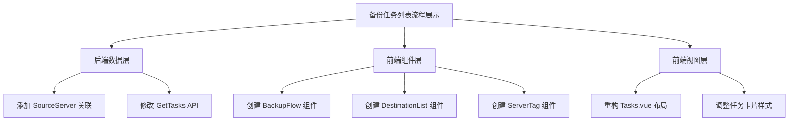
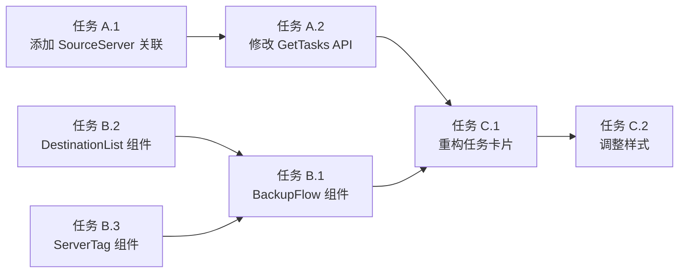

# 功能规划：备份任务列表流程展示优化

**规划时间**：2026-01-08
**预估工作量**：13 任务点

---

## 1. 功能概述

### 1.1 目标

优化备份任务列表的信息展示，增加"从哪到哪"的备份路径信息，让用户一目了然地看到备份流程。

**核心价值**：
- 提升信息可读性：用户无需点击编辑即可了解任务的完整备份路径
- 优化视觉层次：采用流程式布局，清晰展示"源 → 目标"关系
- 增强用户体验：目标列表横向排列，超过 3 个显示 "+N" 折叠

### 1.2 范围

**包含**：
- 后端：为 `BackupTask` 模型添加 `SourceServer` 关联
- 后端：修改 `GetTasks` API 预加载 `SourceServer` 数据
- 前端：创建 `BackupFlow` 组件展示备份流程
- 前端：创建 `DestinationList` 组件展示目标列表
- 前端：重构 `Tasks.vue` 任务卡片布局

**不包含**：
- 任务详情页面
- 目标详情弹窗
- 备份路径编辑功能
- 任务执行状态实时更新

### 1.3 技术约束

- 后端：Go 1.21+, GORM, SQLite
- 前端：Vue 3 Composition API, Tailwind CSS
- 设计风格：Brutalist Design（粗野主义）
- 响应式：支持桌面端（移动端暂不考虑）

---

## 2. WBS 任务分解

### 2.1 分解结构图



### 2.2 任务清单

#### 模块 A：后端数据层（3 任务点）

**文件**: `/Users/mingzaily/Code/tool/bitwarden-backup/internal/database/models.go`

- [ ] **任务 A.1**：为 BackupTask 添加 SourceServer 关联（2 点）
  - **输入**：当前 BackupTask 结构体定义（第 83-94 行）
  - **输出**：BackupTask 包含 SourceServer 关联对象
  - **关键步骤**：
    1. 在 `BackupTask` 结构体中添加字段：
       ```go
       SourceServer ServerConfig `gorm:"foreignKey:SourceServerID" json:"source_server"`
       ```
    2. 位置：第 91 行（`UpdatedAt` 字段之后，`Destinations` 字段之前）
    3. 验证 GORM 标签语法正确
    4. 确保不影响现有数据库结构（只是查询时的关联，不改表结构）

**文件**: `/Users/mingzaily/Code/tool/bitwarden-backup/internal/handler/task.go`

- [ ] **任务 A.2**：修改 GetTasks API 预加载 SourceServer（1 点）
  - **输入**：当前 GetTasks 函数（第 11-19 行）
  - **输出**：API 返回包含 source_server 对象的任务列表
  - **关键步骤**：
    1. 修改第 14 行的 Preload 调用：
       ```go
       // 修改前
       if err := database.DB.Preload("Destinations").Find(&tasks).Error; err != nil {

       // 修改后
       if err := database.DB.Preload("SourceServer").Preload("Destinations").Find(&tasks).Error; err != nil {
       ```
    2. 同时修改 `GetTask` 函数（第 26 行）
    3. 测试 API 返回数据结构

**验收标准**：
- 调用 `/api/tasks` 返回的 JSON 包含 `source_server` 对象
- `source_server` 对象包含 `id`, `name`, `server_url`, `is_official` 等字段
- `destinations` 数组正常返回
- 现有功能不受影响

---

#### 模块 B：前端组件层（6 任务点）

**文件**: `/Users/mingzaily/Code/tool/bitwarden-backup/web/frontend/src/components/BackupFlow.vue`

- [ ] **任务 B.1**：创建 BackupFlow 组件（3 点）
  - **输入**：任务对象（包含 source_server 和 destinations）
  - **输出**：展示备份流程的 Vue 组件
  - **关键步骤**：
    1. 创建新文件 `src/components/BackupFlow.vue`
    2. 定义 Props：
       ```javascript
       const props = defineProps({
         sourceServer: Object,  // 源服务器对象
         destinations: Array    // 目标列表
       })
       ```
    3. 实现布局结构：
       - 源服务器信息（名称 + 类型标签）
       - 流程箭头（↓ 图标）
       - 目标列表（调用 DestinationList 组件）
    4. 样式使用 Tailwind CSS + Brutalist 风格
    5. 添加防御性编程（处理数据为空的情况）

**文件**: `/Users/mingzaily/Code/tool/bitwarden-backup/web/frontend/src/components/DestinationList.vue`

- [ ] **任务 B.2**：创建 DestinationList 组件（2 点）
  - **输入**：目标数组
  - **输出**：横向排列的目标标签列表
  - **关键步骤**：
    1. 创建新文件 `src/components/DestinationList.vue`
    2. 定义 Props：
       ```javascript
       const props = defineProps({
         destinations: {
           type: Array,
           default: () => []
         },
         maxVisible: {
           type: Number,
           default: 3  // 最多显示 3 个
         }
       })
       ```
    3. 实现逻辑：
       - 显示前 N 个目标（默认 3 个）
       - 超过 N 个显示 "+N" 标签
       - 每个目标显示类型图标 + 名称
    4. 样式：横向排列，使用 `flex gap-2`
    5. 类型图标映射：
       - local: 📁
       - webdav: ☁️
       - server: 🖥️
       - s3: 🪣

**文件**: `/Users/mingzaily/Code/tool/bitwarden-backup/web/frontend/src/components/ServerTag.vue`

- [ ] **任务 B.3**：创建 ServerTag 组件（1 点）
  - **输入**：服务器对象
  - **输出**：服务器类型标签
  - **关键步骤**：
    1. 创建新文件 `src/components/ServerTag.vue`
    2. 定义 Props：
       ```javascript
       const props = defineProps({
         isOfficial: Boolean
       })
       ```
    3. 实现逻辑：
       - 官方服务器：蓝色标签 "官方"
       - 自建服务器：灰色标签 "自建"
    4. 样式：小型徽章，与任务类型标签一致

**验收标准**：
- BackupFlow 组件正确展示源服务器和目标列表
- DestinationList 组件正确处理 0、1、3、5 个目标的情况
- ServerTag 组件正确区分官方/自建服务器
- 所有组件支持数据为空的情况（不报错）

---

#### 模块 C：前端视图层（4 任务点）

**文件**: `/Users/mingzaily/Code/tool/bitwarden-backup/web/frontend/src/views/Tasks.vue`

- [ ] **任务 C.1**：重构任务卡片布局（3 点）
  - **输入**：当前 Tasks.vue 模板（第 26-96 行）
  - **输出**：包含备份流程展示的新布局
  - **关键步骤**：
    1. 在任务名称和 Cron 表达式之间插入 BackupFlow 组件
    2. 修改布局结构：
       ```vue
       <div class="px-6 py-4 bg-brutalist-cream/20">
         <!-- 任务名称 + 类型标签 -->
         <div class="flex items-center justify-between mb-3">
           <div class="flex items-center gap-2">
             <h3>{{ task.name }}</h3>
             <span>{{ task.cron_expression ? '定时' : '手动' }}</span>
           </div>
           <!-- 操作按钮 -->
         </div>

         <!-- 备份流程（新增） -->
         <BackupFlow
           :source-server="task.source_server"
           :destinations="task.destinations"
           class="mb-3"
         />

         <!-- Cron 表达式 -->
         <div class="flex items-center text-sm">
           ...
         </div>
       </div>
       ```
    3. 导入新组件：
       ```javascript
       import BackupFlow from '@/components/BackupFlow.vue'
       ```
    4. 调整卡片最小高度（移除 `min-h-[90px]`，改为自适应）

- [ ] **任务 C.2**：调整任务卡片样式（1 点）
  - **输入**：当前任务卡片样式
  - **输出**：优化后的视觉层次
  - **关键步骤**：
    1. 调整内边距：`px-6 py-4` → `px-6 py-5`（增加垂直空间）
    2. 调整间距：各元素之间使用 `mb-3` 统一间距
    3. 确保操作按钮始终在右上角
    4. 测试不同数据量下的布局表现

**验收标准**：
- 任务列表正确展示备份流程
- 布局清晰，信息层次分明
- 操作按钮位置不变
- 无数据时显示友好提示
- 加载状态正常显示

---

## 3. 依赖关系

### 3.1 依赖图



### 3.2 依赖说明

| 任务 | 依赖于 | 原因 | 优先级 |
|------|--------|------|--------|
| A.2 (修改 API) | A.1 (添加关联) | 需要先定义模型关联 | 高 |
| C.1 (重构布局) | A.2 (修改 API) | 需要后端返回完整数据 | 高 |
| C.1 (重构布局) | B.1 (BackupFlow) | 需要组件完成 | 高 |
| B.1 (BackupFlow) | B.2, B.3 | 依赖子组件 | 中 |
| C.2 (调整样式) | C.1 (重构布局) | 布局完成后微调 | 低 |

### 3.3 并行任务

以下任务可以并行开发：
- 任务 B.2 (DestinationList) ∥ 任务 B.3 (ServerTag)
- 任务 A.1 ∥ 任务 B.2 ∥ 任务 B.3（后端和前端子组件可并行）

### 3.4 推荐实施顺序

**阶段 1：后端数据准备**（优先级最高）
1. 任务 A.1：添加 SourceServer 关联
2. 任务 A.2：修改 GetTasks API

**阶段 2：前端组件开发**（可并行）
1. 任务 B.3：ServerTag 组件（最简单）
2. 任务 B.2：DestinationList 组件
3. 任务 B.1：BackupFlow 组件（依赖 B.2 和 B.3）

**阶段 3：前端集成**
1. 任务 C.1：重构任务卡片布局
2. 任务 C.2：调整样式

---

## 4. 实施建议

### 4.1 技术选型

| 需求 | 推荐方案 | 理由 |
|------|----------|------|
| 后端关联加载 | GORM Preload | 标准 ORM 做法，性能好 |
| 组件拆分 | 单一职责原则 | 提高复用性和可维护性 |
| 样式实现 | Tailwind CSS 工具类 | 与现有设计一致 |
| 图标展示 | Emoji | 无需引入图标库，轻量级 |
| 数据容错 | 可选链 + 默认值 | 提高代码健壮性 |

### 4.2 潜在风险

| 风险 | 影响 | 缓解措施 |
|------|------|----------|
| SourceServer 关联导致查询变慢 | 中 | 监控 API 响应时间，必要时添加索引 |
| 目标列表过长导致布局溢出 | 低 | 使用 "+N" 折叠，限制最大显示数量 |
| 数据为空时组件报错 | 中 | 添加防御性编程，使用可选链和默认值 |
| 组件嵌套过深影响性能 | 低 | 组件层级控制在 3 层以内 |

### 4.3 测试策略

- **单元测试**：
  - BackupFlow 组件的数据渲染逻辑
  - DestinationList 组件的折叠逻辑
  - ServerTag 组件的类型判断

- **集成测试**：
  - GetTasks API 返回完整数据结构
  - 任务列表正确展示备份流程
  - 不同数据量下的布局表现

- **E2E 测试**：
  - 完整的任务列表加载流程
  - 备份流程信息正确显示
  - 操作按钮功能正常

---

## 5. 验收标准

功能完成需满足以下条件：

- [ ] 后端 API 返回包含 `source_server` 和 `destinations` 的完整数据
- [ ] 任务列表正确展示"源 → 目标"备份流程
- [ ] 目标列表超过 3 个时显示 "+N" 折叠
- [ ] 服务器类型标签正确显示（官方/自建）
- [ ] 目标类型图标正确显示
- [ ] 数据为空时不报错，显示友好提示
- [ ] 现有功能（编辑、删除、执行）不受影响
- [ ] 布局在不同数据量下表现良好
- [ ] 代码通过 ESLint 检查
- [ ] 无控制台错误或警告

---

## 6. 后续优化方向（可选）

Phase 2 可考虑的增强：
- 点击 "+N" 展开显示所有目标
- 目标标签支持 Tooltip 显示详细信息
- 备份流程支持动画效果
- 添加备份路径的可视化图表
- 支持拖拽调整目标顺序

---

**文档版本**：v1.0
**最后更新**：2026-01-08
**项目路径**：`/Users/mingzaily/Code/tool/bitwarden-backup`
