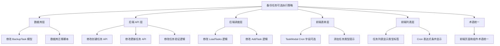

# 功能规划：备份任务可选执行策略

**规划时间**：2026-01-08
**预估工作量**：17 任务点

---

## 1. 功能概述

### 1.1 目标

将"定时任务"改名为"备份任务"，并支持可选的执行策略：
- 用户可以创建不填写 Cron 表达式的备份任务（纯手动触发）
- 用户可以创建带 Cron 表达式的备份任务（自动定时执行）
- 保留现有的"立即执行"功能
- 统一术语：所有"定时任务"改为"备份任务"

### 1.2 范围

**包含**：
- 数据库：允许 `cron_expression` 字段为空（可选）
- 后端：调度器跳过没有 Cron 表达式的任务
- 后端：API 验证逻辑调整
- 前端：表单 Cron 表达式改为可选
- 前端：任务列表显示任务类型（定时/手动）
- 前端：术语统一（所有"定时任务"改为"备份任务"）

**不包含**：
- 批量手动触发
- 任务执行历史增强
- 任务优先级
- 任务分组管理

### 1.3 技术约束

- 后端：Go 1.21+, Gin, GORM, SQLite
- 前端：Vue 3 Composition API, Tailwind CSS
- 调度器：robfig/cron v3（支持秒级 Cron 表达式）
- 数据库：SQLite（需要考虑字段约束变更）

---

## 2. WBS 任务分解

### 2.1 分解结构图

### 2.2 任务清单

#### 模块 A：数据库层（3 任务点）

**文件**: `/Users/mingzaily/Code/tool/bitwarden-backup/internal/database/models.go`

- [ ] **任务 A.1**：修改 BackupTask 模型字段约束（2 点）
  - **输入**：当前 BackupTask 结构体定义（第 82-94 行）
  - **输出**：CronExpression 字段允许为空
  - **关键步骤**：
    1. 定位 `BackupTask` 结构体的 `CronExpression` 字段（第 87 行）
    2. 移除 `not null` 约束：`gorm:"size:100;not null"` → `gorm:"size:100"`
    3. 保持 JSON 标签不变：`json:"cron_expression"`
    4. 验证 GORM 标签语法正确

- [ ] **任务 A.2**：创建数据库迁移脚本（1 点）
  - **输入**：当前数据库 schema
  - **输出**：SQLite 迁移 SQL 脚本
  - **关键步骤**：
    1. 创建迁移文件 `internal/database/migrations/002_optional_cron.sql`
    2. 编写 ALTER TABLE 语句移除 NOT NULL 约束
    3. 添加迁移说明注释
    4. 测试迁移脚本在现有数据库上执行

**验收标准**：
- 新建任务时 `cron_expression` 可以为空字符串或 NULL
- 现有任务数据不受影响
- GORM 查询和保存操作正常

---

#### 模块 B：后端 API 层（4 任务点）

**文件**: `/Users/mingzaily/Code/tool/bitwarden-backup/internal/handler/task.go`

- [ ] **任务 B.1**：修改创建任务 API 验证逻辑（2 点）
  - **输入**：当前 CreateTask 处理器函数
  - **输出**：支持可选 Cron 表达式的创建逻辑
  - **关键步骤**：
    1. 定位 `CreateTask` 函数（需要查找文件）
    2. 移除 Cron 表达式的必填验证
    3. 添加条件验证：如果提供了 Cron 表达式，则验证格式
    4. 使用 robfig/cron 的 `cron.ParseStandard()` 验证表达式
    5. 返回友好的错误提示

- [ ] **任务 B.2**：修改更新任务 API 验证逻辑（1 点）
  - **输入**：当前 UpdateTask 处理器函数
  - **输出**：支持可选 Cron 表达式的更新逻辑
  - **关键步骤**：
    1. 定位 `UpdateTask` 函数
    2. 应用与 CreateTask 相同的验证逻辑
    3. 允许将 Cron 表达式更新为空（从定时改为手动）
    4. 允许将空 Cron 表达式更新为有效值（从手动改为定时）

- [ ] **任务 B.3**：添加 Cron 表达式验证辅助函数（1 点）
  - **输入**：无
  - **输出**：可复用的验证函数
  - **关键步骤**：
    1. 在 `internal/handler/task.go` 添加 `validateCronExpression` 函数
    2. 接受字符串参数，返回 error
    3. 空字符串返回 nil（允许为空）
    4. 非空字符串使用 `cron.ParseStandard()` 验证
    5. 返回格式化的错误信息

**验收标准**：
- POST `/api/tasks` 可以不传 `cron_expression` 字段
- POST `/api/tasks` 传入无效 Cron 表达式返回 400 错误
- PUT `/api/tasks/:id` 可以将 Cron 表达式设为空
- API 返回清晰的错误提示

---

#### 模块 C：后端调度层（3 任务点）

**文件**: `/Users/mingzaily/Code/tool/bitwarden-backup/internal/scheduler/task.go`

- [ ] **任务 C.1**：修改 LoadTasks 逻辑（1 点）
  - **输入**：当前 LoadTasks 函数（第 10-26 行）
  - **输出**：只加载有 Cron 表达式的任务到调度器
  - **关键步骤**：
    1. 定位 `LoadTasks` 函数
    2. 在 GORM 查询中添加条件：`Where("enabled = ? AND cron_expression != ?", true, "")`
    3. 或在循环中跳过空 Cron 表达式的任务
    4. 添加日志输出：跳过的手动任务数量

- [ ] **任务 C.2**：修改 AddTask 逻辑（2 点）
  - **输入**：当前 AddTask 函数（需要查找）
  - **输出**：跳过没有 Cron 表达式的任务
  - **关键步骤**：
    1. 定位 `AddTask` 函数（可能在 `scheduler.go` 或 `task.go`）
    2. 在函数开头添加检查：`if task.CronExpression == "" { return nil }`
    3. 添加日志：`log.Printf("Skipping manual task: %s", task.Name)`
    4. 确保不影响现有的 Cron 任务调度

**验收标准**：
- 启动服务时，只有带 Cron 表达式的任务被加载到调度器
- 手动任务不会被自动执行
- 日志清晰显示加载的定时任务和跳过的手动任务
- 手动触发功能（立即执行）仍然正常工作

---

#### 模块 D：前端表单层（3 任务点）

**文件**: `/Users/mingzaily/Code/tool/bitwarden-backup/web/frontend/src/components/TaskModal.vue`

- [ ] **任务 D.1**：Cron 表达式字段改为可选（2 点）
  - **输入**：当前 TaskModal 表单（第 22-26 行）
  - **输出**：Cron 表达式字段可选，带提示
  - **关键步骤**：
    1. 移除 `required` 属性：`<input v-model="formData.cron_expression" type="text" required` → `<input v-model="formData.cron_expression" type="text"`
    2. 修改标签文字：`Cron 表达式` → `执行策略（可选）`
    3. 修改提示文字：`示例: 0 0 2 * * * (每天凌晨2点)` → `留空则为手动任务，填写 Cron 表达式则自动定时执行。示例: 0 0 2 * * * (每天凌晨2点)`
    4. 添加占位符提示：`placeholder="留空为手动任务，填写 Cron 表达式为定时任务"`

- [ ] **任务 D.2**：添加任务类型提示（1 点）
  - **输入**：当前表单布局
  - **输出**：动态显示任务类型
  - **关键步骤**：
    1. 在 Cron 表达式字段下方添加提示标签
    2. 使用 computed 属性计算任务类型：`const taskType = computed(() => formData.value.cron_expression ? '定时任务' : '手动任务')`
    3. 显示徽章：`{{ taskType }}`

**验收标准**：
- 创建任务时可以不填写 Cron 表达式
- 表单提示清晰说明可选性
- 动态显示任务类型（定时/手动）
- 表单验证不阻止提交空 Cron 表达式

---
