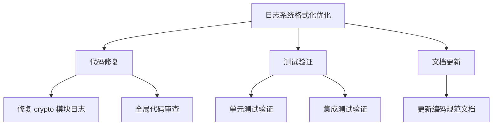
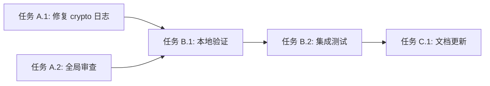

# 功能规划：日志系统格式化优化

**规划时间**：2026-01-10
**预估工作量**：8 任务点

---

## 1. 功能概述

### 1.1 目标
修复 Go `log/slog` 结构化日志系统中的格式化参数错误，并优化日志模块标识规范，使日志输出符合结构化日志最佳实践。

### 1.2 范围

**包含**：
- 修复所有使用 `fmt.Printf` 风格的 `slog` 日志调用（`%s`、`%d` 等格式化符号）
- 将消息前缀模块标识（如 `[encryption]`）改为独立的 `module` 字段
- 统一日志调用规范，确保所有日志使用键值对风格
- 验证修复后的日志输出格式

**不包含**：
- 修改日志输出目标（仍然输出到 stdout）
- 修改日志级别配置逻辑
- 添加新的日志功能（如日志轮转、远程日志等）

### 1.3 技术约束
- **技术栈**：Go 1.21+, `log/slog` 标准库
- **兼容性**：保持现有 API 接口不变，避免破坏性修改
- **性能要求**：日志调用不应引入明显性能开销
- **代码风格**：遵循 Go 官方代码规范

---

## 2. 问题分析

### 2.1 受影响文件清单

通过代码检索，确认以下文件存在问题：

| 文件路径 | 问题类型 | 问题数量 | 优先级 |
|---------|---------|---------|--------|
| `internal/crypto/crypto.go` | 格式化参数错误 + 模块标识不规范 | 8 处 | 高 |
| `internal/bitwarden/client.go` | 已使用正确格式（无需修改） | 0 处 | - |
| `internal/bitwarden/export.go` | 已使用正确格式（无需修改） | 0 处 | - |
| `cmd/server/main.go` | 已使用正确格式（无需修改） | 0 处 | - |

### 2.2 问题详细分析

#### 问题 1：格式化参数错误

**错误示例**（`internal/crypto/crypto.go:42`）：
```go
logger.Info("[encryption] Master key loaded from %s file", dataEnvPath)
```

**问题**：
- `slog` 期望键值对：`logger.Info(msg, key1, value1, key2, value2, ...)`
- 实际传入了 `fmt.Printf` 风格的格式化字符串
- 导致 `%s` 未被替换，`dataEnvPath` 被解析为 `!BADKEY`

**正确写法**：
```go
logger.Info("Master key loaded from file", "module", "encryption", "file", dataEnvPath)
```

#### 问题 2：模块标识不规范

**当前方式**：
```go
logger.Info("[encryption] Master key loaded from file")
```

**问题**：
- 模块标识混在消息文本中，不利于日志过滤和分析
- 不符合结构化日志最佳实践

**优化方案**：
```go
logger.Info("Master key loaded from file", "module", "encryption")
```

### 2.3 影响范围统计

**`internal/crypto/crypto.go` 中的 8 处问题**：

| 行号 | 当前代码 | 问题类型 |
|-----|---------|---------|
| 34 | `logger.Info("[encryption] Master key loaded from environment variable")` | 模块标识不规范 |
| 42 | `logger.Info("[encryption] Master key loaded from %s file", dataEnvPath)` | 格式化错误 + 模块标识 |
| 50 | `logger.Info("[encryption] Master key loaded from %s file", envPath)` | 格式化错误 + 模块标识 |
| 55 | `logger.Info("[encryption] No master key found, generating new key...")` | 模块标识不规范 |
| 61 | `logger.Info("[encryption] New master key generated and saved to %s", dataEnvPath)` | 格式化错误 + 模块标识 |
| 62 | `logger.Info("[encryption] Key is persisted in data/ directory")` | 模块标识不规范 |
| 73 | `logger.Info("[encryption] New master key generated and saved to %s", envPath)` | 格式化错误 + 模块标识 |
| 74 | `logger.Info("[encryption] ⚠️  IMPORTANT: Backup this .env file!")` | 模块标识不规范 |

---

## 3. WBS 任务分解

### 3.1 分解结构图



### 3.2 任务清单

#### 模块 A：代码修复（5 任务点）

##### 任务 A.1：修复 `internal/crypto/crypto.go` 日志调用（3 点）

**文件**: `D:/Code/bitwarden-backup/internal/crypto/crypto.go`

**输入**：当前存在格式化错误的日志代码
**输出**：符合 `slog` 规范的日志调用
**关键步骤**：

1. **修复第 34 行**：
   ```go
   // 修改前
   logger.Info("[encryption] Master key loaded from environment variable")

   // 修改后
   logger.Info("Master key loaded from environment variable", "module", "encryption")
   ```

2. **修复第 42 行**：
   ```go
   // 修改前
   logger.Info("[encryption] Master key loaded from %s file", dataEnvPath)

   // 修改后
   logger.Info("Master key loaded from file", "module", "encryption", "file", dataEnvPath)
   ```

3. **修复第 50 行**：
   ```go
   // 修改前
   logger.Info("[encryption] Master key loaded from %s file", envPath)

   // 修改后
   logger.Info("Master key loaded from file", "module", "encryption", "file", envPath)
   ```

4. **修复第 55 行**：
   ```go
   // 修改前
   logger.Info("[encryption] No master key found, generating new key...")

   // 修改后
   logger.Info("No master key found, generating new key", "module", "encryption")
   ```

5. **修复第 61 行**：
   ```go
   // 修改前
   logger.Info("[encryption] New master key generated and saved to %s", dataEnvPath)

   // 修改后
   logger.Info("New master key generated and saved", "module", "encryption", "file", dataEnvPath)
   ```

6. **修复第 62 行**：
   ```go
   // 修改前
   logger.Info("[encryption] Key is persisted in data/ directory")

   // 修改后
   logger.Info("Key is persisted in data/ directory", "module", "encryption")
   ```

7. **修复第 73 行**：
   ```go
   // 修改前
   logger.Info("[encryption] New master key generated and saved to %s", envPath)

   // 修改后
   logger.Info("New master key generated and saved", "module", "encryption", "file", envPath)
   ```

8. **修复第 74 行**：
   ```go
   // 修改前
   logger.Info("[encryption] ⚠️  IMPORTANT: Backup this .env file!")

   // 修改后
   logger.Info("IMPORTANT: Backup this .env file!", "module", "encryption")
   ```

**验收标准**：
- 所有日志调用使用键值对格式
- 模块标识统一使用 `"module"` 字段
- 无格式化占位符（`%s`、`%d` 等）

---

##### 任务 A.2：全局代码审查（2 点）

**文件**: 全项目 Go 文件

**输入**：项目所有 Go 源代码
**输出**：确认无其他格式化错误的日志调用
**关键步骤**：

1. **使用 grep 搜索潜在问题**：
   ```bash
   # 搜索可能的格式化字符串
   grep -rn 'logger\.\(Info\|Error\|Warn\|Debug\).*%[sdvfx]' internal/ cmd/

   # 搜索消息前缀模式
   grep -rn 'logger\.\(Info\|Error\|Warn\|Debug\).*\[.*\]' internal/ cmd/
   ```

2. **检查以下高风险模块**：
   - `internal/scheduler/*.go`
   - `internal/handler/*.go`
   - `internal/webdav/*.go`
   - `internal/config/*.go`

3. **验证 `bitwarden` 模块**：
   - 确认 `internal/bitwarden/client.go` 已使用正确格式（第 157-161 行）
   - 确认 `internal/bitwarden/export.go` 无问题

4. **生成审查报告**：
   - 列出所有检查的文件
   - 标注需要修复的位置（如有）

**验收标准**：
- 完成全项目 Go 文件扫描
- 确认无遗漏的格式化错误
- 生成审查清单

---

#### 模块 B：测试验证（2 任务点）

##### 任务 B.1：本地运行验证（1 点）

**文件**: 无（运行时验证）

**输入**：修复后的代码
**输出**：正确格式的日志输出
**关键步骤**：

1. **启动服务器**：
   ```bash
   cd D:/Code/bitwarden-backup
   go run ./cmd/server
   ```

2. **触发加密模块初始化**：
   - 删除 `data/.env` 文件（如存在）
   - 重启服务器，观察密钥生成日志

3. **验证日志格式**：
   - 检查 stdout 输出
   - 确认 JSON 格式正确
   - 确认 `module` 字段存在
   - 确认无 `!BADKEY` 错误

4. **预期日志示例**：
   ```json
   {"time":"2026/01/10 15:30:45","level":"INFO","msg":"No master key found, generating new key","module":"encryption"}
   {"time":"2026/01/10 15:30:45","level":"INFO","msg":"New master key generated and saved","module":"encryption","file":"data/.env"}
   {"time":"2026/01/10 15:30:45","level":"INFO","msg":"Key is persisted in data/ directory","module":"encryption"}
   ```

**验收标准**：
- 日志输出为有效 JSON
- 所有字段正确解析
- 无格式化占位符残留

---

##### 任务 B.2：集成测试验证（1 点）

**文件**: 无（集成测试）

**输入**：完整运行的系统
**输出**：所有模块日志格式正确
**关键步骤**：

1. **测试完整备份流程**：
   - 配置 Bitwarden 服务器
   - 创建备份任务
   - 执行备份

2. **检查各模块日志**：
   - `encryption` 模块：密钥加载日志
   - `bitwarden` 模块：CLI 执行日志
   - `scheduler` 模块：任务调度日志
   - `handler` 模块：API 请求日志

3. **日志分析**：
   - 使用 `jq` 工具解析 JSON 日志
   - 验证 `module` 字段一致性
   - 检查是否有异常字段（如 `!BADKEY`）

4. **示例验证命令**：
   ```bash
   # 提取所有 encryption 模块日志
   cat server.log | jq 'select(.module == "encryption")'

   # 检查是否有 BADKEY 错误
   cat server.log | grep -i badkey
   ```

**验收标准**：
- 完整备份流程无错误
- 所有模块日志格式统一
- 日志可被 JSON 解析器正确解析

---

#### 模块 C：文档更新（1 任务点）

##### 任务 C.1：更新编码规范文档（1 点）

**文件**: `D:/Code/bitwarden-backup/CLAUDE.md`

**输入**：当前编码规范章节
**输出**：包含日志规范的更新文档
**关键步骤**：

1. **在 "编码规范" 章节添加日志子章节**：
   ```markdown
   ### 日志规范
   - 使用 `log/slog` 标准库进行结构化日志记录
   - 日志调用使用键值对格式：`logger.Info(msg, key1, value1, key2, value2, ...)`
   - 禁止使用 `fmt.Printf` 风格的格式化字符串（`%s`、`%d` 等）
   - 模块标识使用独立的 `module` 字段，而非消息前缀
   - 示例：
     ```go
     // 正确
     logger.Info("Master key loaded", "module", "encryption", "file", path)

     // 错误
     logger.Info("[encryption] Master key loaded from %s", path)
     ```
   ```

2. **更新 "AI 使用指引" 章节**：
   - 添加日志调用规范到常见任务清单
   - 提供日志调试命令示例

**验收标准**：
- 文档更新完整
- 示例代码正确
- 格式清晰易读

---

## 4. 依赖关系

### 4.1 依赖图



### 4.2 依赖说明

| 任务 | 依赖于 | 原因 |
|------|--------|------|
| B.1 | A.1, A.2 | 需要代码修复完成后才能验证 |
| B.2 | B.1 | 需要基础验证通过后再进行集成测试 |
| C.1 | B.2 | 需要确认修复方案有效后再更新文档 |

### 4.3 并行任务

以下任务可以并行开发：
- 任务 A.1 和 A.2 可以同时进行（不同开发者）
- 任务 C.1 可以在 B.1 完成后提前开始（无需等待 B.2）

---

## 5. 实施建议

### 5.1 技术选型

| 需求 | 推荐方案 | 理由 |
|------|----------|------|
| 日志库 | `log/slog` (标准库) | 已使用，无需更换 |
| 日志格式 | JSON | 已配置，便于机器解析 |
| 日志验证工具 | `jq` | 标准 JSON 处理工具 |

### 5.2 潜在风险

| 风险 | 影响 | 缓解措施 |
|------|------|----------|
| 遗漏其他模块的格式化错误 | 中 | 任务 A.2 进行全局代码审查 |
| 修改后日志消息语义变化 | 低 | 保持消息核心含义不变，仅调整格式 |
| 性能影响 | 低 | `slog` 键值对格式性能优于格式化字符串 |
| 向后兼容性 | 低 | 日志格式变化不影响功能逻辑 |

### 5.3 测试策略

- **单元测试**：无需添加（日志调用不影响业务逻辑）
- **集成测试**：通过完整备份流程验证日志输出
- **日志验证**：使用 `jq` 工具验证 JSON 格式正确性

### 5.4 回滚方案

如果修复后出现问题，可以通过 Git 回滚：
```bash
git checkout HEAD -- internal/crypto/crypto.go
```

---

## 6. 验收标准

功能完成需满足以下条件：

- [ ] `internal/crypto/crypto.go` 中 8 处日志调用全部修复
- [ ] 全局代码审查完成，无遗漏问题
- [ ] 本地运行验证通过，日志格式正确
- [ ] 集成测试通过，所有模块日志统一
- [ ] 编码规范文档更新完成
- [ ] 无 `!BADKEY` 错误出现
- [ ] 日志可被 `jq` 正确解析

---

## 7. 实施时间估算

基于任务点估算（1 点 ≈ 1-2 小时）：

| 模块 | 任务点 | 预估时间 |
|------|--------|---------|
| 代码修复 | 5 点 | 5-10 小时 |
| 测试验证 | 2 点 | 2-4 小时 |
| 文档更新 | 1 点 | 1-2 小时 |
| **总计** | **8 点** | **8-16 小时** |

---

## 8. 后续优化方向（可选）

Phase 2 可考虑的增强：

1. **封装便捷方法**：
   ```go
   // 在 internal/logger/logger.go 中添加
   func InfoWithModule(module, msg string, args ...any) {
       Get().Info(msg, append([]any{"module", module}, args...)...)
   }
   ```

2. **统一模块常量**：
   ```go
   const (
       ModuleEncryption = "encryption"
       ModuleBitwarden  = "bitwarden"
       ModuleScheduler  = "scheduler"
   )
   ```

3. **添加日志级别动态调整**：
   - 支持运行时修改日志级别
   - 添加 HTTP API 端点

4. **日志聚合**：
   - 集成 Loki 或 Elasticsearch
   - 添加日志查询界面

---

## 附录：快速修复脚本

如果需要快速验证修复效果，可以使用以下命令：

```bash
# 1. 备份原文件
cp internal/crypto/crypto.go internal/crypto/crypto.go.bak

# 2. 应用修复（手动编辑或使用 sed）
# （具体修改见任务 A.1）

# 3. 验证语法
go build ./internal/crypto

# 4. 运行服务器并查看日志
go run ./cmd/server 2>&1 | tee server.log

# 5. 验证 JSON 格式
cat server.log | jq . > /dev/null && echo "JSON valid" || echo "JSON invalid"

# 6. 提取 encryption 模块日志
cat server.log | jq 'select(.module == "encryption")'
```

---

**文档版本**：v1.0
**最后更新**：2026-01-10
**负责人**：待分配
