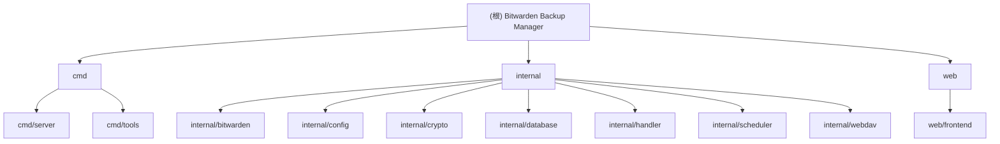

# Bitwarden Backup Manager - AI 上下文文档

## 变更记录 (Changelog)

### 2026-01-07 01:54:20
- 初始化 AI 上下文文档
- 完成项目架构扫描与模块识别
- 生成根级与模块级文档

---

## 项目愿景

Bitwarden Backup Manager 是一个自动化的 Bitwarden 密码库备份和迁移工具，旨在为个人和企业用户提供可靠的密码库数据保护方案。系统支持多源服务器配置、多目标备份（本地、WebDAV、目标服务器）、定时任务调度，并通过 Web 界面提供友好的管理体验。

**核心价值**：
- 自动化备份流程，降低人工操作风险
- 多目标备份策略，提升数据安全性
- AES-256-GCM 加密保护敏感凭证
- 简洁直观的 Web 管理界面

---

## 架构总览

### 技术栈
- **后端**: Go 1.21+, Gin Web Framework, GORM, SQLite
- **前端**: Vue 3, Vue Router, Vite, Tailwind CSS
- **调度**: robfig/cron (支持秒级 Cron 表达式)
- **加密**: AES-256-GCM + PBKDF2 密钥派生
- **外部依赖**: Bitwarden CLI (@bitwarden/cli)

### 架构模式
- **前后端分离**: RESTful API + SPA
- **数据持久化**: SQLite (GORM ORM)
- **任务调度**: Cron 定时器 + 即时执行
- **安全机制**: GORM 钩子自动加密/解密敏感字段

---

## 模块结构图



---

## 模块索引

| 模块路径 | 职责 | 语言 | 入口文件 |
|---------|------|------|---------|
| `cmd/server` | HTTP 服务器主程序 | Go | `main.go`, `router.go` |
| `cmd/tools` | 工具脚本集合 | Go | `test-task/main.go` |
| `internal/bitwarden` | Bitwarden CLI 客户端封装 | Go | `client.go` |
| `internal/config` | 配置加载与环境变量管理 | Go | `config.go` |
| `internal/crypto` | AES-256-GCM 加密/解密 | Go | `crypto.go` |
| `internal/database` | 数据库连接与模型定义 | Go | `db.go`, `models.go` |
| `internal/handler` | HTTP 请求处理器 (Controllers) | Go | `server.go`, `destination.go`, `task.go`, `log.go` |
| `internal/scheduler` | Cron 任务调度与备份执行 | Go | `scheduler.go`, `backup.go` |
| `internal/webdav` | WebDAV 客户端实现 | Go | `client.go`, `upload.go` |
| `web/frontend` | Vue 3 前端应用 | JavaScript/Vue | `src/main.js` |

---

## 运行与开发

### 本地开发

**后端启动**:
```bash
# 安装依赖
go mod download

# 运行服务器
go run ./cmd/server

# 或编译后运行
go build -o bitwarden-backup ./cmd/server
./bitwarden-backup
```

**前端开发**:
```bash
cd web/frontend
npm install
npm run dev      # 开发模式
npm run build    # 生产构建
```

### Docker 部署

```bash
# 使用 Docker Compose
docker compose up -d

# 查看日志
docker compose logs -f
```

### 环境变量

| 变量 | 说明 | 默认值 |
|------|------|--------|
| `SERVER_PORT` | HTTP 服务端口 | `8080` |
| `DB_PATH` | SQLite 数据库路径 | `./data/bitwarden-backup.db` |
| `LOG_LEVEL` | 日志级别 | `info` |
| `BITWARDEN_BACKUP_MASTER_KEY` | 加密主密钥 (自动生成) | 自动生成并保存到 `.env` |

---

## 测试策略

### 当前状态
- **单元测试**: 未发现测试文件 (`*_test.go`, `*.spec.ts`)
- **集成测试**: 无
- **E2E 测试**: 无

### 建议补充
1. 为 `internal/crypto` 模块添加加密/解密单元测试
2. 为 `internal/bitwarden` 添加 CLI 调用 Mock 测试
3. 为 `internal/scheduler` 添加任务调度逻辑测试
4. 为前端组件添加 Vitest 单元测试

---

## 编码规范

### Go 代码规范
- 遵循 Go 官方代码风格 (gofmt)
- 包命名使用小写单词，避免下划线
- 导出函数/类型使用大写字母开头
- 错误处理使用 `fmt.Errorf` 包装上下文信息

### Vue 代码规范
- 使用 Composition API (`<script setup>`)
- 组件命名采用 PascalCase
- Props 使用 camelCase
- 样式使用 Tailwind CSS 工具类

### 数据库规范
- 使用 GORM 标签定义字段约束
- 敏感字段通过 `BeforeSave`/`AfterFind` 钩子自动加密/解密
- 外键关系使用 `gorm:"foreignKey"` 显式声明

### 日志规范
- 使用 `log/slog` 标准库进行结构化日志记录
- 日志调用使用键值对格式：`logger.Info(msg, key1, value1, key2, value2, ...)`
- 禁止使用 `fmt.Printf` 风格的格式化字符串（`%s`、`%d` 等）
- 模块标识使用独立的 `module` 字段，而非消息前缀
- 示例：
  ```go
  // 正确
  logger.Info("Master key loaded", "module", "encryption", "file", path)

  // 错误
  logger.Info("[encryption] Master key loaded from %s", path)
  ```

---

## AI 使用指引

### 常见任务

**1. 添加新的备份目标类型**
- 修改 `internal/database/models.go` 中的 `BackupDestination` 模型
- 在 `internal/scheduler/destination_handler.go` 添加新类型处理逻辑
- 更新前端 `web/frontend/src/components/DestinationModal.vue` 表单

**2. 修改 API 端点**
- 路由定义: `cmd/server/router.go`
- 处理器实现: `internal/handler/*.go`
- 前端 API 调用: `web/frontend/src/api/index.js`

**3. 调整调度逻辑**
- 核心调度器: `internal/scheduler/scheduler.go`
- 任务加载: `internal/scheduler/task.go`
- 备份执行: `internal/scheduler/backup.go`

**4. 修改数据模型**
- 模型定义: `internal/database/models.go`
- 迁移逻辑: `internal/database/migrate.go`
- 响应结构: `internal/database/response.go`

### 关键文件速查

| 需求 | 关键文件 |
|------|---------|
| 修改路由 | `cmd/server/router.go` |
| 添加 API | `internal/handler/*.go` |
| 数据模型 | `internal/database/models.go` |
| 加密逻辑 | `internal/crypto/crypto.go` |
| 任务调度 | `internal/scheduler/scheduler.go` |
| 前端路由 | `web/frontend/src/router/index.js` |
| 前端 API | `web/frontend/src/api/index.js` |
| UI 组件 | `web/frontend/src/components/*.vue` |

### 调试建议
- 后端日志: 查看 `server.log` 或容器日志
- 数据库检查: 使用 SQLite 客户端连接 `data/bitwarden-backup.db`
- 前端调试: 浏览器开发者工具 Network 面板查看 API 请求
- Cron 表达式验证: 使用在线工具验证 6 位 Cron 表达式 (秒 分 时 日 月 周)

---

## 相关文档

- [README.md](./README.md) - 项目介绍与快速开始
- [Dockerfile](./Dockerfile) - Docker 镜像构建配置
- [docker-compose.yml](./docker-compose.yml) - Docker Compose 编排配置
- [go.mod](./go.mod) - Go 依赖管理
- [web/frontend/package.json](./web/frontend/package.json) - 前端依赖管理
