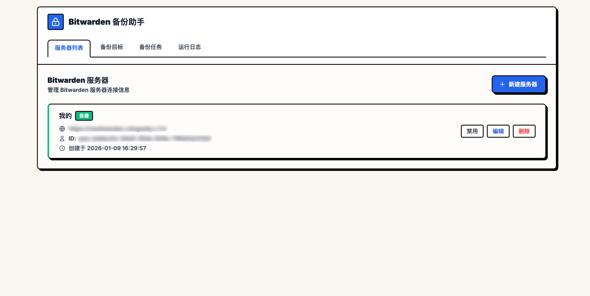

# Bitwarden Backup

自动化 Bitwarden 密码库备份和迁移工具，支持多目标备份（本地、WebDAV、S3、目标服务器）。

[](https://github.com/mingzaily/bitwarden-backup/releases)
[](https://github.com/mingzaily/bitwarden-backup/pkgs/container/bitwarden-backup)
[](https://opensource.org/licenses/MIT)
[](https://github.com/mingzaily/bitwarden-backup)



## 为什么选择这个工具？

GitHub 上大多数 Bitwarden 备份方案采用 **数据库文件备份 + rclone** 的方式，直接复制 Vaultwarden/Bitwarden 的 SQLite 数据库文件。这种方式存在一些局限：

- 需要直接访问服务器文件系统
- 备份的是加密的数据库文件，恢复时依赖原有密钥
- 无法跨服务器迁移数据

**本工具采用不同的思路** —— 基于 **Bitwarden CLI 导出 JSON** 的方式：

| 特性 | 数据库备份 + rclone | 本工具（JSON 导出） |
|------|---------------------|---------------------|
| 备份方式 | 复制加密的 db 文件 | 通过 API 导出明文/加密 JSON |
| 服务器访问 | 需要文件系统权限 | 仅需 API 凭证 |
| 跨服务器迁移 | 不支持 | 原生支持 |
| 官方服务器 | 不适用 | 完全支持 |
| 备份可读性 | 不可读 | JSON 格式，可检查 |
| 恢复方式 | 替换数据库文件 | 通过 Bitwarden 导入 |

**适用场景**：
- 使用官方 Bitwarden 服务，无法访问服务器文件
- 需要在多个 Bitwarden 实例间迁移数据
- 希望备份文件可读、可验证
- 需要 Web 界面管理备份任务

## 功能特性

- 🕐 定时自动备份（支持 5/6 位 Cron 表达式）
- 📦 多备份目标支持：本地存储、WebDAV、S3 兼容存储、目标服务器迁移
- 🖥️ Web 管理界面（Brutalist 风格 UI）
- 🔄 支持多源服务器配置
- 📊 备份历史和日志查看（支持分页）
- 🧹 自动清理：临时文件清理 + 备份保留策略
- 🔐 AES-256-GCM 加密保护敏感凭证
- 🐳 多架构 Docker 镜像（amd64/arm64）

## ⚠️ 安全提示

> **重要**：本工具**不包含登录认证功能**，Web 管理界面和 API 接口均无访问控制。
>
> **强烈建议**：
> - 仅在**内网环境**或**本地**运行，不要直接暴露到公网
> - 如需远程访问，请通过 **VPN** 或配置**反向代理 + Basic Auth**（如 Nginx、Traefik）
> - 数据库中存储了 Bitwarden 凭证（已加密），请妥善保护 `data/` 目录

## 快速开始

### 方式一：Docker Compose（推荐）

```bash
mkdir bitwarden-backup && cd bitwarden-backup
curl -O https://raw.githubusercontent.com/mingzaily/bitwarden-backup/master/docker-compose.yml
```

编辑 `docker-compose.yml`，配置加密密钥：

```yaml
environment:
  - BITWARDEN_BACKUP_MASTER_KEY=your-secret-key-here  # 建议使用随机字符串
  - TZ=Asia/Shanghai
```

启动服务：

```bash
docker compose up -d
```

访问 `http://localhost:8080` 进入管理界面。

### 方式二：Docker Run

```bash
docker run -d \
  --name bitwarden-backup \
  -p 8080:8080 \
  -e BITWARDEN_BACKUP_MASTER_KEY=your-secret-key-here \
  -e TZ=Asia/Shanghai \
  -v ./data:/app/data \
  -v ./backups:/app/backups \
  ghcr.io/mingzaily/bitwarden-backup:latest
```

### 方式三：从源码构建

```bash
git clone https://github.com/mingzaily/bitwarden-backup.git
cd bitwarden-backup

# 构建前端
cd web && npm install && npm run build && cd ..

# 构建后端
go build -o bitwarden-backup ./cmd/server

# 运行
./bitwarden-backup
```

**前置要求**：
- Go 1.23+
- Node.js 20+
- [Bitwarden CLI](https://bitwarden.com/help/cli/)（需全局安装：`npm install -g @bitwarden/cli`）

## 配置说明

### 环境变量

| 变量 | 必填 | 说明 | 默认值 |
|------|------|------|--------|
| `BITWARDEN_BACKUP_MASTER_KEY` | 否 | 加密主密钥 | 自动生成 |
| `SERVER_PORT` | 否 | 服务端口 | `8080` |
| `DB_PATH` | 否 | 数据库路径 | `/app/data/bitwarden-backup.db` |
| `TZ` | 否 | 时区 | `Asia/Shanghai` |

### 加密密钥管理

**推荐**：通过环境变量 `BITWARDEN_BACKUP_MASTER_KEY` 配置密钥。

如未配置，系统会自动生成并保存到 `data/.env`。

> **提示**：建议定期备份 `data/` 目录，其中包含数据库和密钥文件。

## 使用指南

### 1. 配置源服务器

在"源服务器"页面添加 Bitwarden 服务器配置：

- **服务器 URL**: Bitwarden 服务器地址（如 `https://vault.bitwarden.com`）
- **Client ID / Client Secret**: API 密钥（在 Bitwarden 设置中获取）
- **Master Password**: 主密码（用于解锁密码库导出数据）

### 2. 配置备份目标

支持四种备份目标类型：

- **本地存储**: 备份到 `/app/backups` 目录
- **WebDAV**: 备份到 WebDAV 服务器（如 Nextcloud）
- **S3**: 备份到 S3 兼容存储（AWS S3、MinIO、阿里云 OSS 等）
- **目标服务器**: 导入到另一个 Bitwarden 服务器

### 3. 创建备份任务

配置定时备份任务，支持 6 位 Cron 表达式（秒 分 时 日 月 周）：

```
0 0 2 * * *    # 每天凌晨 2 点
0 0 */6 * * *  # 每 6 小时
0 30 1 * * 1   # 每周一凌晨 1:30
```

## 目录结构

```
/app/
├── data/       # 数据库文件和密钥
├── backups/    # 本地备份文件
└── .tmp/       # 临时文件（自动清理）
```

## 技术栈

- **后端**: Go 1.23, Gin, GORM, SQLite
- **前端**: Vue 3, Vite, Tailwind CSS
- **调度**: robfig/cron（支持秒级调度）
- **加密**: AES-256-GCM + PBKDF2

## 开发

```bash
# 开发模式（前端热重载 + 后端）
cd web && npm run dev &
go run ./cmd/server

# 或使用开发脚本
./dev.sh
```

## License

MIT
