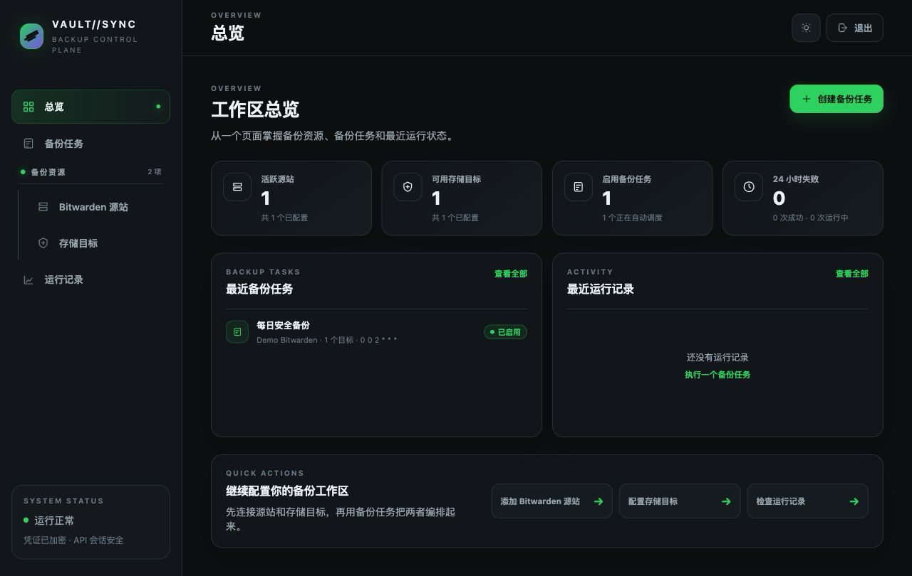

# Bitwarden Backup

通过 Bitwarden CLI 导出密码库，并将备份保存到本地、WebDAV、S3 或另一个 Bitwarden 服务器。适合个人备份、异地保存和实例迁移。

[](https://github.com/mingzaily/bitwarden-backup/releases)
[](https://github.com/mingzaily/bitwarden-backup/pkgs/container/bitwarden-backup)
[](https://opensource.org/licenses/MIT)



## 功能

- 定时或手动执行备份，支持 6 位 Cron 表达式
- 支持本地存储、WebDAV、S3 兼容存储和目标 Bitwarden 服务器
- 管理多个 Bitwarden 源站、存储目标和备份任务
- 查看运行记录、备份产物和错误详情，支持批量删除记录（不删除备份文件）
- 支持备份文件加密、保留策略和临时文件清理
- 提供 amd64/arm64 Docker 镜像

## 快速开始

### Docker Compose（推荐）

准备数据目录和管理员密码：

```bash
mkdir -p data backups
export BITWARDEN_BACKUP_ADMIN_PASSWORD='至少 8 位的随机密码'
docker compose up -d
```

默认使用项目中的 [`docker-compose.yml`](docker-compose.yml)，服务监听 `http://localhost:8080`。

数据目录说明：

- `./data`：数据库和加密密钥，必须持久化
- `./backups`：本地备份文件，使用本地存储目标时需要持久化

### Docker Run

```bash
docker run -d \
  --name bitwarden-backup \
  --restart unless-stopped \
  -p 8080:8080 \
  -e BITWARDEN_BACKUP_ADMIN_PASSWORD='至少 8 位的随机密码' \
  -e TZ=Asia/Shanghai \
  -v "$PWD/data:/app/data" \
  -v "$PWD/backups:/app/backups" \
  ghcr.io/mingzaily/bitwarden-backup:latest
```

### 从源码运行

要求 Go 1.25.13+、Node.js 22+ 和 Bitwarden CLI：

```bash
git clone https://github.com/mingzaily/bitwarden-backup.git
cd bitwarden-backup
npm --prefix web ci
npm --prefix web run build
npm install -g @bitwarden/cli
BITWARDEN_BACKUP_ADMIN_PASSWORD='至少 8 位的随机密码' go run ./cmd/server
```

## 配置

| 环境变量 | 必填 | 说明 | 默认值 |
| --- | --- | --- | --- |
| `BITWARDEN_BACKUP_ADMIN_PASSWORD` | 是 | Web 管理员密码，至少 8 位 | 无 |
| `BITWARDEN_BACKUP_MASTER_KEY` | 否 | 加密主密钥；未设置时自动生成并保存 | 自动生成 |
| `SERVER_PORT` | 否 | HTTP 端口 | `8080` |
| `DB_PATH` | 否 | SQLite 数据库路径 | `./data/bitwarden-backup.db` |
| `APP_VERSION` | 否 | 页面显示的版本号；Release 镜像由 CI 自动注入 | `DEV` |
| `AUTH_COOKIE_SECURE` | 否 | HTTPS 反向代理时启用 Secure Cookie | `false` |
| `TZ` | 否 | 时区 | `Asia/Shanghai` |

未设置 `BITWARDEN_BACKUP_MASTER_KEY` 时，密钥会写入 `data/.env`。请务必持久化并保护 `data/`，否则无法解密已保存的凭证。

## 使用流程

1. 在「备份资源 → Bitwarden 源站」添加源站，填写 Client ID、Client Secret 和 Master Password。
2. 在「备份资源 → 存储目标」添加备份落点：本地、WebDAV、S3 或目标服务器。
3. 在「备份任务」中选择源站、一个或多个目标，并设置手动执行或 Cron 计划。
4. 可在任务中配置备份文件名模板；默认生成 `bitwarden_encrypted_export_YYYYMMDDHHmmss.json`，支持 `{time}`、`{task_name}` 和 `{medium}`（`local` / `webdav` / `oss`）。
5. 存储目标的保留数量按当前任务的文件名模板执行；在「存储目标」可直接测试 WebDAV 连接，在「运行记录」查看状态、各服务商日志、HTTP 响应和备份文件。

## 安全

- Web 管理界面和 API 使用应用层会话登录，不是 Nginx Basic Auth。
- 会话使用 HttpOnly、SameSite Cookie，写操作启用 CSRF 校验；会话有效期为 12 小时，服务重启后失效。
- 不建议直接暴露到公网；远程访问时请使用 HTTPS 反向代理或 VPN，并设置 `AUTH_COOKIE_SECURE=true`。
- Bitwarden 凭证和加密密钥保存在 `data/`，请限制目录权限并纳入可靠备份。

## 发布

维护者直接在 GitHub 创建并发布 Release；发布后 GitHub Actions 会按 Release tag 构建 amd64/arm64 镜像，并推送到 [GHCR](https://github.com/mingzaily/bitwarden-backup/pkgs/container/bitwarden-backup)。

## 开发

```bash
# 前端热重载
npm --prefix web install
npm --prefix web run dev

# 另开终端启动后端
BITWARDEN_BACKUP_ADMIN_PASSWORD='至少 8 位的随机密码' go run ./cmd/server
```

如果 Go 报错 `checksum database disabled by GOSUMDB=off`，可使用官方模块代理启动：

```bash
GOSUMDB=sum.golang.org \
GOPROXY=https://proxy.golang.org,direct \
GOTOOLCHAIN=auto \
go run ./cmd/server
```

## License

MIT
